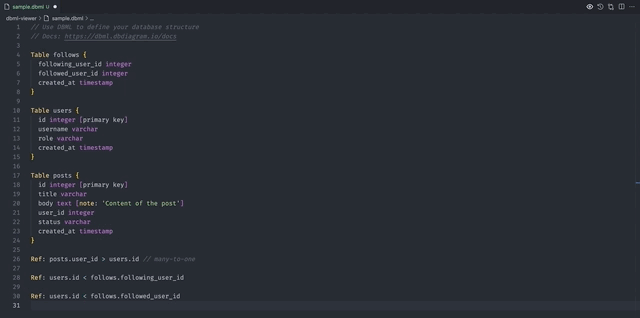

# DBML Live Preview

An extension for Visual Studio Code that provides real-time rendering of a database schema from the generated DBML code.

## Features

-   Live preview (eye icon in the top right corner / command palette)
-   Download SVG (in command palette)
-   Code Structure with layout of code

## TODO

-   Light/dark mode toggle

## Demo

## Appendix

This extension is a perfect complement to [vscode-dbml](vscode:extension/matt-meyers.vscode-dbml) (color syntaxing and SQL export commands).

## References

Here are some related projects used in this extension

[@softwaretechnik-berlin/dbml-renderer](https://github.com/softwaretechnik-berlin/dbml-renderer/)

## Authors

-   [@Durandal14](https://www.github.com/durandal14)
